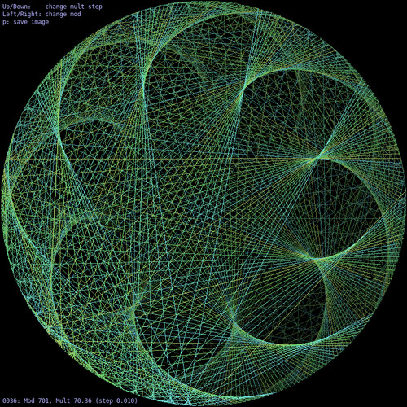

This repository contains small computer code to render maths equations.

# Examples
```shell
$ ./complex-fractal/julia_set.py --c "(-0.55+0.56j)"
JuliaSet explorer
=================

Click the window to center
Use keyboard arrow to move window, 'a'/'e' to zoom in/out, 'r' to reset view
Use 'qzsd' to change c value or RETURN key to browse known seeds
```


```shell
./complex-fractal/mandelbrot_set.py
MandelbrotSet explorer
======================

Left/right click to zoom in/out, Middle click to draw JuliaSet
Use keyboard arrow to move view and r to reset
```


```shell
./complex-fractal/animation_mandelbrot_zoom.py --size 5 --opencl \
	--color log+sin+lightblue --max_iter 10000 \
	--center "(-1.010164627168485-0.3124969856767653j)" \
	--radius 9.84953164603e-10 --record $(pwd)/zoom --steps 1848
```


```shell
./arithmetic/multiplication_on_a_circle.py
```


```shell
./bifurcational-fractal/markus_lyapunov.py --seed AB
Markus-Lyapunov explorer
========================

Click the window to center
Use keyboard arrow to move window, 'a'/'e' to zoom in/out, 'r' to reset view
```


``` shell
# Render gif with palette
ffmpeg  -y -framerate 12 -start_number 0 -i %04d.jpg -vf fps=10,scale=320:-1:flags=lanczos,palettegen test.png
ffmpeg  -y -framerate 1 -start_number 0 -i %04d.jpg -i test.png -filter_complex "fps=10,scale=320:-1:flags=lanczos[x];[x][1:v]paletteuse" output.gif

# Render webm
ffmpeg  -y -framerate 12 -start_number 0 -i %04d.png -i sound.ogg -c:a libvorbis  -c:v libvpx -threads 4 -b:v 5M /tmp/test.webm
```
