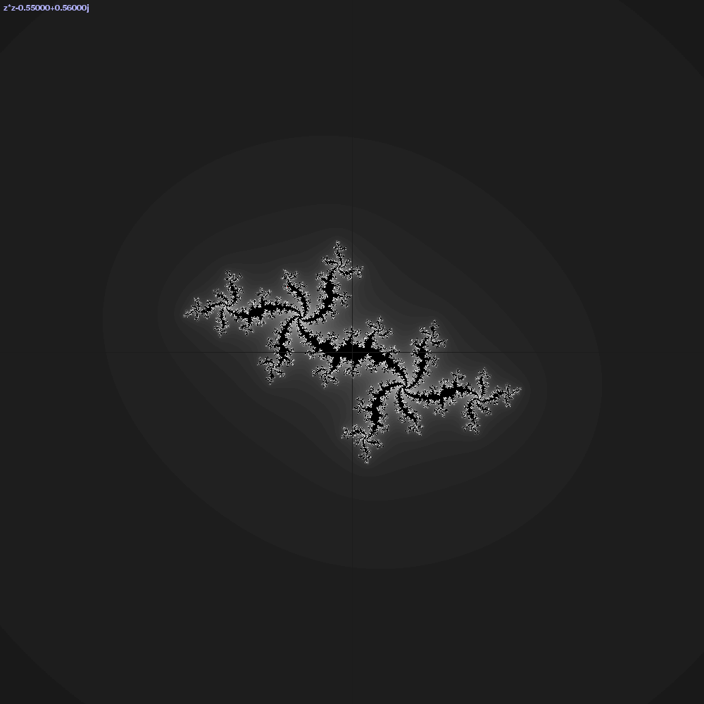
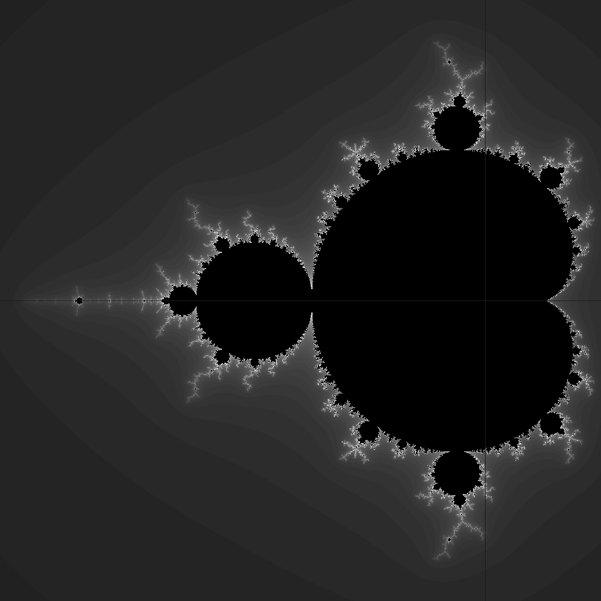
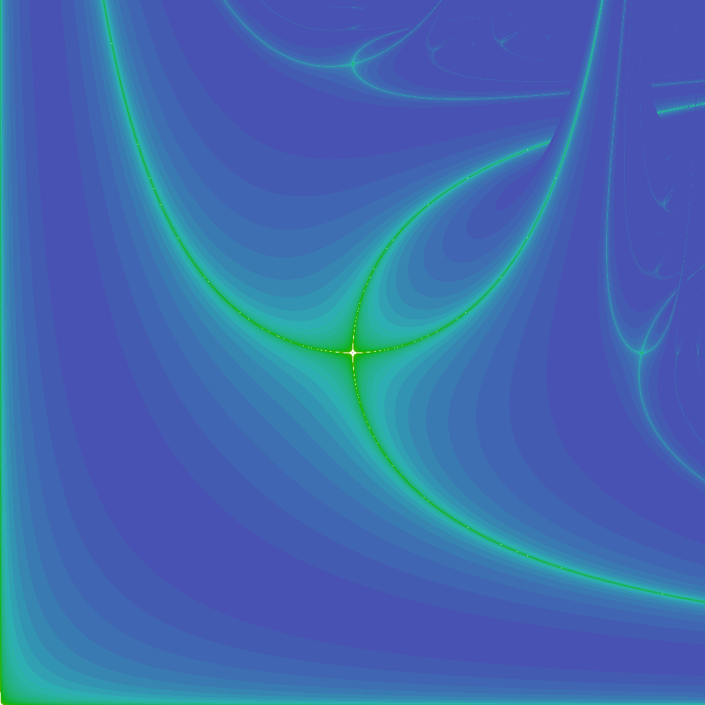

This repository contains small computer code to render maths equations.

# Examples
```shell
$ ./complex-fractal/julia_set.py --c "(-0.55+0.56j)"
JuliaSet explorer
=================

Click the window to center
Use keyboard arrow to move window, 'a'/'e' to zoom in/out, 'r' to reset view
Use 'qzsd' to change c value or RETURN key to browse known seeds
```


```shell
./complex-fractal/mandelbrot_set.py
MandelbrotSet explorer
======================

Left/right click to zoom in/out, Middle click to draw JuliaSet
Use keyboard arrow to move view and r to reset
```


```shell
./bifurcational-fractal/markus_lyapunov.py --seed AB
Markus-Lyapunov explorer
========================

Click the window to center
Use keyboard arrow to move window, 'a'/'e' to zoom in/out, 'r' to reset view
```


# Python usages
```shell
usage: script.py [-h] [--record DIR] [--size SIZE] [--center CENTER]
                    [--radius RADIUS] [--worker WORKER] [--seed SEED] [--c C]
                    [--sampling SAMPLING]

optional arguments:
  -h, --help           show this help message and exit
  --record DIR         record frame in png
  --size SIZE          render size (2.5)
  --center CENTER      plane center(0)
  --radius RADIUS      plane radius (3)
  --worker WORKER      number of cpu (4)
  --seed SEED          str seed
  --c C                complex seed (0j)
  --sampling SAMPLING
```
